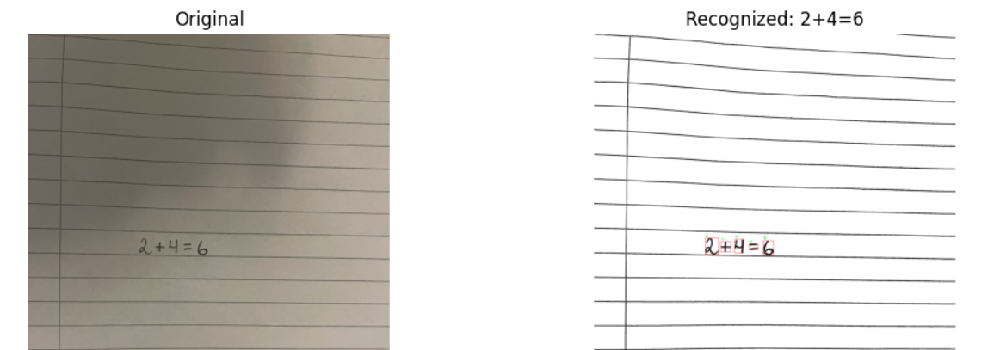

# Math Symbol Recognizer

A computer vision project developed as part of the NTNU course **IDATG2206 - Computer Vision**, aiming to recognize and solve simple handwritten mathematical expressions using deep learning.

---

## Supported Symbols

- **Digits**: `0–9`  
- **Operators**: `+`, `-`, `*`, `/`, `=`  
- **Variables**: `w`, `x`, `y`, `z`

---

## Project Structure
```bash
mathsolver/
├── dataset/
│   ├── train/                # Raw training images (organized in folders per class)
│   └── preprocessed/         # Preprocessed and augmented training images
│
├── dataset_tools/
│   ├── augment_dataset.py         # Applies preprocessing and data augmentation
│   ├── count_total_dataset.py     # Counts images per class
│   ├── evaluate_single_symbols.py # Tests model accuracy on single symbols
│   ├── organize_dataset.py        # Organizes raw images into class folders
│   ├── plot_training_history.py   # Visualizes training history (accuracy/loss)
│   └── preview_augmentations.py   # Shows augmentations on a sample image
│
├── models/
│   ├── digit_classifier.h5   # Trained CNN model
│   └── training_history.pkl  # Accuracy/loss log from training
│
├── runtime_utils/
│   └── preprocessing.py       # Applies filters, noise removal, edge detection
│
├── scripts/
│   ├── main.py                # Main entry point (predicts math expressions)
│   ├── segment_and_predict.py # Segments and classifies individual symbols
│   └── train.py               # Trains the CNN model
│
├── test-images/
│   ├── equations/             # Test images with full handwritten expressions
│   └── single-symbols/        # Test images with one symbol for evaluation
│
└── README.md
```
## 🚀 How to Use

### 1. Install dependencies

```bash
pip install -r requirements.txt
```

### 2. Train the model
```bash
python scripts/train.py
```

### 3. Run the recognition system
```bash
python scripts/main.py
```

Edit the `mode` variable in `main.py` to choose between:
- `"single"` : Run on a specific image (edit the filename in the script)
- `"latest"` : Automatically use the most recently saved image
- `"all"` : Process all images in the `test-images/equations/` folder


## Example Output


## Known Limitations & Challenges
Despite successful implementation of segmentation and symbol classification, the system has a few known challenges:

### Symbol Detection Issues
* Equals sign (=): Since it often consists of two short dashes, it's sometimes predicted as two minus symbols (- -) instead of being merged correctly. A custom merge heuristic was added, but it doesn't always work reliably on all handwriting styles.

* Dot vs Multiply (. vs *): The model may confuse decimal points with multiplication symbols, especially when dots are used for both purposes in handwritten input.

* Bounding Box Merging Errors: Some wide symbols or symbols written close together are incorrectly grouped into one box, leading to misclassification.

### Image Quality Sensitivity
* Distance & angle: Input images taken too close, too far, or at skewed angles often result in incorrect symbol segmentation or missed symbols.

* Grid paper interference: Images written on lined or squared paper may confuse the edge detector, sometimes generating extra bounding boxes or including grid lines as false symbols.

### Model Limitations
* The classifier is trained only on individual symbols. 

* No context-aware correction or grammar parsing is applied. Predictions are made symbol-by-symbol with no understanding of mathematical structure.

## Features
* Character segmentation and classification

* Preprocessing pipeline: denoising, edge enhancement, thresholding

* Augmented training data for improved model robustness

* Evaluation tools for testing individual symbol predictions

## Technologies
* Python

* OpenCV

* TensorFlow / Keras

## Course Info
* Course: IDATG2206—Computer Vision

* University: NTNU

* Semester: Spring 2025

Feel free to contribute or adapt the project for your own applications!
